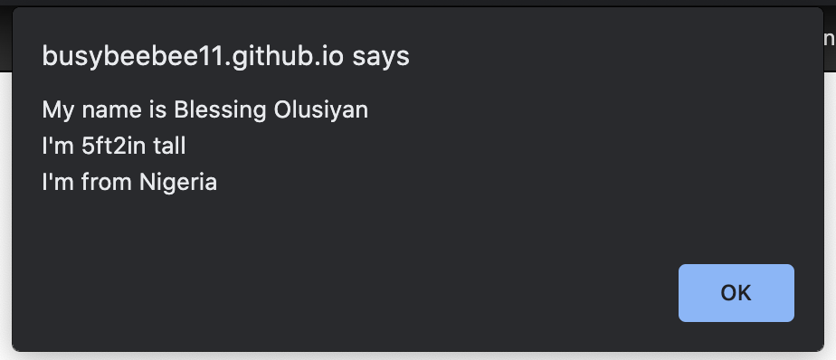

## FIRST JS CODE
---
 ### This is my first code written with JS.

### Nothing fancy just a brief feel of JS.
---
CODE FIELD
```javascript
var myName = "Blessing Olusiyan \n"
var height = "5ft2in tall \n"
var country = "Nigeria \n"

alert("My name is " + myName + "I'm " + height + "I'm from " + country)
```
---
## HOSTED PAGE
[https://busybeebee11.github.io/javascript-task/]
---

OUTCOME



